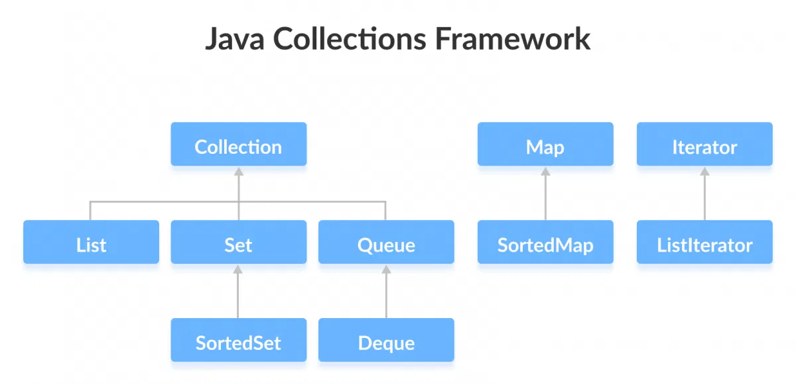

# Java Collections Framework 

The Java collections framework provides a set of interfaces and classes 
to implement various data structures and algorithms.

## Interfaces of Collections FrameWork
The Java collections framework provides various interfaces. These interfaces include several methods to perform different operations on collections.

## Java Collection Interface
The Collection interface is the root interface of the collections framework hierarchy.

Java does not provide direct implementations of the `Collection` interface but provides implementations of its subinterfaces like `List`, `Set`, and `Queue`. 

## Collections Framework Vs. Collection Interface
People often get confused between the collections framework and `Collection` Interface.

The `Collection` interface is the root interface of the collections framework. The framework includes other interfaces as well: `Map` and `Iterator`. These interfaces may also have subinterfaces.